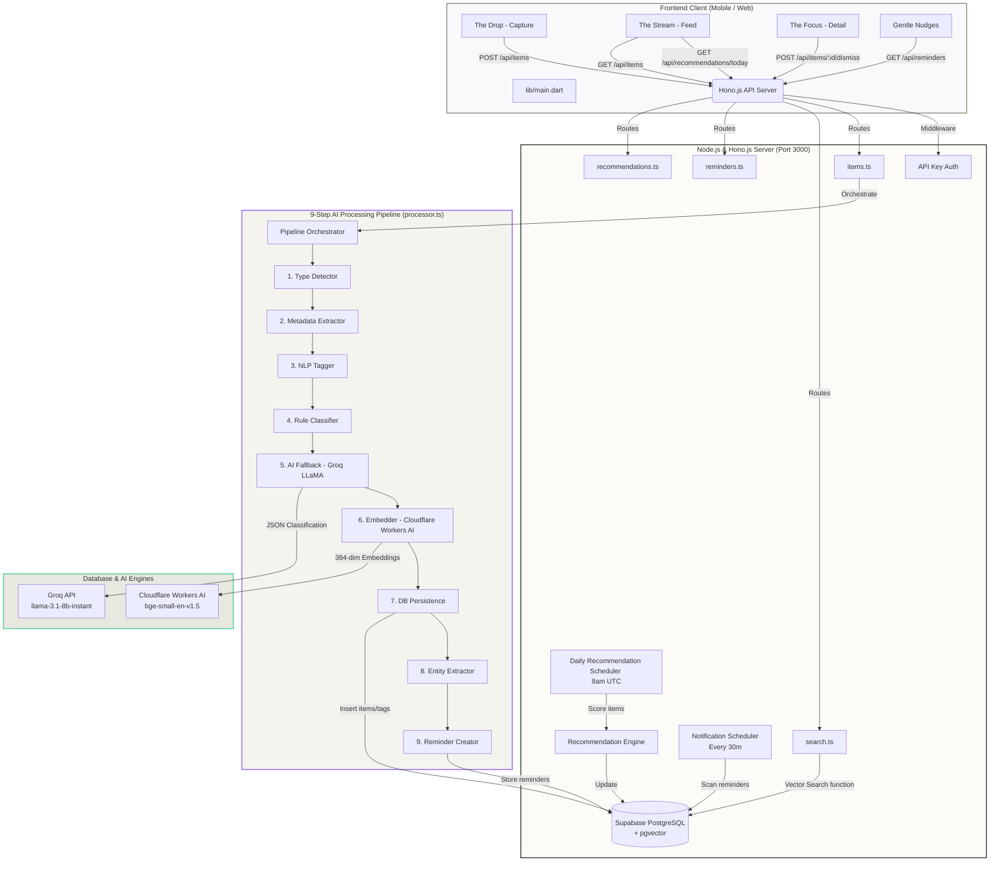

# 🧠 Second Brain (Soft Mind)

[](https://flutter.dev)
[](https://hono.dev)
[](https://supabase.com)
[](https://groq.com)
[](https://developers.cloudflare.com/workers-ai/)

> **A digital pebble sanctuary for your scattered thoughts, links, and files.**  
> AI quietly organizes your chaotic inputs into a serene, highly readable feed for gentle review later. Inspired by Cosmos, Are.na, and Zen meditation timers.

---

## 📖 Table of Contents
1. [What is Second Brain?](#-what-is-second-brain)
2. [Key Features](#-key-features)
3. [Architecture Overview](#%EF%B8%8F-architecture-overview)
4. [Tech Stack](#-tech-stack)
5. [Directory Structure](#-directory-structure)
6. [Database Schema](#%EF%B8%8F-database-schema)
7. [The 9-Step AI Processing Pipeline](#-the-9-step-ai-processing-pipeline)
8. [Daily Scoring & Recommendation Engine](#-daily-scoring--recommendation-engine)
9. [API Reference](#-api-reference)
10. [Setup & Installation](#-setup--installation)
11. [Design System & Aesthetics](#-design-system--aesthetics)
12. [Next.js Migration Plan](#-next-js-migration-plan)

---

## 🧠 What is Second Brain?

In an era of information overload, chronically online students, researchers, and developers constantly hoard knowledge—bookmarks, open tabs, raw text snippets, PDFs, and code references. Standard bookmark tools require active management, filing, and categorization. The result? **A digital landfill where notes go to die.**

**Second Brain** (originally code-named **Soft Mind**) solves this with a **zero-friction capture model**. 
You throw in raw thoughts, URLs, images, or documents. You do not tag them. You do not put them in folders. 
The background **9-Step AI Processing Pipeline** analyzes the content, extracts metadata, performs Natural Language Processing (NLP), runs classification models, embeds the text in a 384-dimensional vector space, detects deadlines, and automatically generates action items and reminders. 

Later, you review your organized inputs in a calm, beautifully curated card stream. To keep your information loop closed, the system runs a daily **Scoring and Recommendation Engine** that resurfaces forgotten items, upcoming deadlines, and fresh unread notes using a weighted scoring model.

---

## ✨ Key Features

*   **⚡ Zero-Friction Capture ("The Drop"):** A single-purpose, hyper-minimal input screen. Write or paste anything, release, and watch it dissolve into your second brain.
*   **📂 Multi-Format Support:** Handles links (YouTube, articles, docs), notes (text snippets, ideas), and files (PDFs, images) uniformly.
*   **🤖 9-Step AI Orchestrator:** Pipeline that classifies, extracts keywords, crawls web links, embeds, and structures tasks.
*   **⏰ Auto-Reminders & Entity Extraction:** Automatically extracts `TASK`, `DEADLINE`, `PERSON`, `PROJECT`, and `PRIORITY` using `chrono-node` and `compromise.js`, creating scheduled system reminders.
*   **💡 Daily Recommendations ("Recommended for You"):** Daily at 8:00 AM UTC, the engine scores your items on **Urgency (35%)**, **Freshness (40%)**, and **Re-engagement (25%)**, highlighting the top 5.
*   **🔍 Vector Similarity (Semantic) & Hybrid Search:** Search by query meaning rather than exact keywords using `pgvector` Cosine Similarity, with a robust fallback to tag-based indexing.
*   **🔕 Calm, Organic Minimalism:** Soft organic colors (sage green, warm oats, terracotta highlights), large rounded edges (`32px` border radius), and a distraction-free reader mode.

---

## 🛠️ Architecture Overview



---

## 💻 Tech Stack

| Layer | Technology | Purpose |
| :--- | :--- | :--- |
| **Mobile Frontend** | **Flutter (Dart 3.x)** | Clean cross-platform client with custom state provider, smooth navigation, and system channels. |
| **Backend API** | **Node.js (TypeScript) + Hono.js v4.7.0** | Ultra-fast HTTP router with global logger, CORS handling, and API key authorization. |
| **Database** | **Supabase (PostgreSQL)** | Persistent storage supporting vector coordinates, transactions, and foreign key relations. |
| **Vector Engine** | **pgvector** | Native PostgreSQL extension for storing and indexing embeddings, enabling fast cosine similarity queries. |
| **NLP Engine** | **compromise.js** | Lightweight, client-side NLP library for extracting keywords, nouns, and POS tagging without API overhead. |
| **Date Parsing** | **chrono-node** | Natural language date parser for extracting deadlines from sentences like *"finish by next Thursday"*. |
| **AI LLM Inference** | **Groq SDK (LLaMA-3.1-8B-Instant)** | Ultra-fast JSON classification and summarizing if local confidence rules fall below threshold. |
| **Embeddings** | **Cloudflare Workers AI** | Generates 384-dimensional vector mappings using the `@cf/baai/bge-small-en-v1.5` model. |
| **Link Scraping** | **@extractus/article-extractor** | Scrapes articles, blogs, and web links to extract HTML bodies, clean titles, descriptions, and authors. |
| **Storage** | **Supabase Storage** | Private bucket storage (`items-attachments`) for capturing documents, images, and audio. |

---

## 📂 Directory Structure

Here are the key files and folders in the workspace:

```
scnd_brain/
├── lib/                                     # 📱 Flutter Mobile Frontend
│   ├── main.dart                            # Entrypoint, MultiProvider setup, theme load
│   ├── models/
│   │   └── [item.dart](file:///C:/Users/anshu/OneDrive/Desktop/Projects/scnd_brain/lib/models/item.dart)                 # Item, Tag, Category, Note, and File serialization schemas
│   ├── providers/
│   │   └── [providers.dart](file:///C:/Users/anshu/OneDrive/Desktop/Projects/scnd_brain/lib/providers/providers.dart)           # ItemsProvider (feed, categories) & SearchProvider (debounced search state)
│   ├── services/
│   │   └── [api_service.dart](file:///C:/Users/anshu/OneDrive/Desktop/Projects/scnd_brain/lib/services/api_service.dart)       # REST Client with x-api-key headers, multi-part file uploads
│   ├── screens/
│   │   ├── [dump_screen.dart](file:///C:/Users/anshu/OneDrive/Desktop/Projects/scnd_brain/lib/screens/dump_screen.dart)       # "The Drop": frictionless capture textarea
│   │   ├── [feed_screen.dart](file:///C:/Users/anshu/OneDrive/Desktop/Projects/scnd_brain/lib/screens/feed_screen.dart)       # "The Stream": feed grid, categories, daily recommendation slider
│   │   ├── [detail_screen.dart](file:///C:/Users/anshu/OneDrive/Desktop/Projects/scnd_brain/lib/screens/detail_screen.dart)     # "The Focus": distraction-free reading, attachment views
│   │   ├── [search_screen.dart](file:///C:/Users/anshu/OneDrive/Desktop/Projects/scnd_brain/lib/screens/search_screen.dart)     # Semantic/Hybrid search screen
│   │   └── [reminders_screen.dart](file:///C:/Users/anshu/OneDrive/Desktop/Projects/scnd_brain/lib/screens/reminders_screen.dart)  # "Gentle Nudges": task review, marking complete
│   └── app/
│       └── [theme.dart](file:///C:/Users/anshu/OneDrive/Desktop/Projects/scnd_brain/lib/app/theme.dart)                 # Cognitive Nebula styles, colors, and font configurations
│
└── server/                                  # ⚙️ Node.js + Hono.js Backend
    ├── src/
    │   ├── [index.ts](file:///C:/Users/anshu/OneDrive/Desktop/Projects/scnd_brain/server/src/index.ts)                   # Server startup, global middleware, scheduler intervals (30m / 8am)
    │   ├── lib/
    │   │   └── [config.ts](file:///C:/Users/anshu/OneDrive/Desktop/Projects/scnd_brain/server/src/lib/config.ts)         # Validation of environment configurations, ports, credentials
    │   ├── db/
    │   │   ├── [client.ts](file:///C:/Users/anshu/OneDrive/Desktop/Projects/scnd_brain/server/src/db/client.ts)         # Supabase client instantiation
    │   │   ├── [queries.ts](file:///C:/Users/anshu/OneDrive/Desktop/Projects/scnd_brain/server/src/db/queries.ts)        # Direct SQL transaction wrappers (CRUD, vector query)
    │   │   └── migrations/                  # SQL Migrations for database setup
    │   │       ├── [001_init.sql](file:///C:/Users/anshu/OneDrive/Desktop/Projects/scnd_brain/server/src/db/migrations/001_init.sql)
    │   │       ├── [002_add_item_notes.sql](file:///C:/Users/anshu/OneDrive/Desktop/Projects/scnd_brain/server/src/db/migrations/002_add_item_notes.sql)
    │   │       ├── [003_add_reminders_and_entities.sql](file:///C:/Users/anshu/OneDrive/Desktop/Projects/scnd_brain/server/src/db/migrations/003_add_reminders_and_entities.sql)
    │   │       ├── [004_add_recommendations.sql](file:///C:/Users/anshu/OneDrive/Desktop/Projects/scnd_brain/server/src/db/migrations/004_add_recommendations.sql)
    │   │       └── [005_add_file_support.sql](file:///C:/Users/anshu/OneDrive/Desktop/Projects/scnd_brain/server/src/db/migrations/005_add_file_support.sql)
    │   ├── middleware/
    │   │   └── [apiKey.ts](file:///C:/Users/anshu/OneDrive/Desktop/Projects/scnd_brain/server/src/middleware/apiKey.ts)       # x-api-key validation middleware
    │   ├── routes/
    │   │   ├── [items.ts](file:///C:/Users/anshu/OneDrive/Desktop/Projects/scnd_brain/server/src/routes/items.ts)           # CRUD endpoints, item updates, attachment bindings
    │   │   ├── [notes.ts](file:///C:/Users/anshu/OneDrive/Desktop/Projects/scnd_brain/server/src/routes/notes.ts)           # Sub-resource notes endpoints
    │   │   ├── [search.ts](file:///C:/Users/anshu/OneDrive/Desktop/Projects/scnd_brain/server/src/routes/search.ts)         # POST /api/search with pgvector Cosine similarity
    │   │   ├── [reminders.ts](file:///C:/Users/anshu/OneDrive/Desktop/Projects/scnd_brain/server/src/routes/reminders.ts)       # CRUD for entity-created and manual reminders
    │   │   ├── [recommendations.ts](file:///C:/Users/anshu/OneDrive/Desktop/Projects/scnd_brain/server/src/routes/recommendations.ts) # Recommendations retrieval & dismissals
    │   │   └── [tags.ts](file:///C:/Users/anshu/OneDrive/Desktop/Projects/scnd_brain/server/src/routes/tags.ts)             # GET /api/tags, /api/categories, /api/profile
    │   ├── pipeline/                        # 🧠 The 9-Step AI Processing Pipeline
    │   │   ├── [processor.ts](file:///C:/Users/anshu/OneDrive/Desktop/Projects/scnd_brain/server/src/pipeline/processor.ts)     # Pipeline Orchestrator (Steps 1 to 9)
    │   │   ├── [typeDetector.ts](file:///C:/Users/anshu/OneDrive/Desktop/Projects/scnd_brain/server/src/pipeline/typeDetector.ts)   # Regex type classifier (link vs note vs file)
    │   │   ├── [metadataExtractor.ts](file:///C:/Users/anshu/OneDrive/Desktop/Projects/scnd_brain/server/src/pipeline/metadataExtractor.ts) # Link crawling & title extractor
    │   │   ├── [nlpTagger.ts](file:///C:/Users/anshu/OneDrive/Desktop/Projects/scnd_brain/server/src/pipeline/nlpTagger.ts)       # NLP tokenizing & POS tagging
    │   │   ├── [ruleClassifier.ts](file:///C:/Users/anshu/OneDrive/Desktop/Projects/scnd_brain/server/src/pipeline/ruleClassifier.ts)   # Score-based keyword matcher
    │   │   ├── [aiClassifier.ts](file:///C:/Users/anshu/OneDrive/Desktop/Projects/scnd_brain/server/src/pipeline/aiClassifier.ts)     # Groq LLM JSON classification
    │   │   ├── [embedder.ts](file:///C:/Users/anshu/OneDrive/Desktop/Projects/scnd_brain/server/src/pipeline/embedder.ts)         # Cloudflare Workers bge-small API embedding generator
    │   │   ├── [entityExtractor.ts](file:///C:/Users/anshu/OneDrive/Desktop/Projects/scnd_brain/server/src/pipeline/entityExtractor.ts)   # Chrono-node + compromise task extractor
    │   │   └── [reminderCreator.ts](file:///C:/Users/anshu/OneDrive/Desktop/Projects/scnd_brain/server/src/pipeline/reminderCreator.ts)   # Entity relational parser to insert reminders
    │   └── services/
    │       ├── [recommendationEngine.ts](file:///C:/Users/anshu/OneDrive/Desktop/Projects/scnd_brain/server/src/services/recommendationEngine.ts) # Algorithms for daily scoring
    │       ├── [dailyScheduler.ts](file:///C:/Users/anshu/OneDrive/Desktop/Projects/scnd_brain/server/src/services/dailyScheduler.ts)       # Scheduler calculating remaining delay till 8am UTC
    │       ├── [notificationScheduler.ts](file:///C:/Users/anshu/OneDrive/Desktop/Projects/scnd_brain/server/src/services/notificationScheduler.ts) # Scheduler processing alerts every 30 minutes
    │       └── [fileUploadService.ts](file:///C:/Users/anshu/OneDrive/Desktop/Projects/scnd_brain/server/src/services/fileUploadService.ts)   # Supabase Storage attachment uploads
    └── package.json
```

---

## 🗄️ Database Schema

The database uses Supabase PostgreSQL with `pgvector` enabled for 384-dimensional vector matching.

```
       ┌────────────────────────┐
       │      user_profile      │
       ├────────────────────────┤
       │ id (UUID, PK)          │
       │ display_name (TEXT)    │
       │ created_at (TZ)        │
       └────────────────────────┘

       ┌────────────────────────┐
       │       categories       │
       ├────────────────────────┤
       │ id (UUID, PK)          │
       │ name (TEXT, Unique)    │
       │ color (TEXT)           │
       └────────────────────────┘
                    ▲
                    │ 1-to-Many
                    │ (via item_categories join table)
                    ▼
 ┌───────────────────────────────────────┐          Many-to-Many          ┌────────────────────────┐
 │                 items                 │◀──────────────────────────────▶│          tags          │
 ├───────────────────────────────────────┤ (via item_tags join table)     ├────────────────────────┤
 │ id (UUID, PK)                         │                                │ id (UUID, PK)          │
 │ type (TEXT: link | note | file)       │                                │ name (TEXT, Unique)    │
 │ content_raw (TEXT)                    │                                └────────────────────────┘
 │ title (TEXT)                          │
 │ description (TEXT)                    │
 │ source_url (TEXT)                     │
 │ ai_summary (TEXT)                     │
 │ confidence_score (REAL)               │
 │ embedding (vector(384))               │
 │ file_count (INTEGER)                  │
 │ has_attachment (BOOLEAN)              │
 │ files (JSONB)                         │
 │ opened (BOOLEAN)                      │
 │ opened_at (TZ)                        │
 │ view_count (INTEGER)                  │
 │ last_viewed_at (TZ)                   │
 │ reengagement_notified_at (TS)         │
 │ reengagement_dismissed_at (TS)        │
 │ created_at / updated_at (TZ)          │
 └───────────────────────────────────────┘
     │               │               │
     │ 1-to-Many     │ 1-to-Many     │ 1-to-Many
     ▼               ▼               ▼
 ┌──────────┐    ┌──────────┐    ┌───────────────────────────────────────┐
 │item_notes│    │ entities │    │         daily_recommendations         │
 ├──────────┤    ├──────────┤    ├───────────────────────────────────────┤
 │id (PK)   │    │id (PK)   │    │ id (UUID, PK)                         │
 │item_id   │    │item_id   │    │ item_id (UUID, FK)                    │
 │content   │    │text      │    │ score (FLOAT, 0-100)                  │
 │urgency   │    │type      │    │ reason (TEXT)                         │
 │created_at│    │value     │    │ metadata (JSONB)                      │
 └──────────┘    │confid.   │    │ dismissed_at (TIMESTAMP)              │
                 │metadata  │    │ created_at / expires_at (TIMESTAMP)   │
                 └──────────┘    └───────────────────────────────────────┘
                       │                             ▲
                       │ (Liberal Pair)              │ 1-to-Many
                       ▼                             ▼
                 ┌──────────┐            ┌───────────────────────────────┐
                 │reminders │            │   recommendation_dismissals   │
                 ├──────────┤            ├───────────────────────────────┤
                 │id (PK)   │            │ id (UUID, PK)                 │
                 │item_id   │            │ recommendation_id (UUID, FK)  │
                 │task_name │            │ item_id (UUID, FK)            │
                 │due_date  │            │ reason (TEXT)                 │
                 │priority  │            │ dismissed_at (TIMESTAMP)      │
                 │status    │            └───────────────────────────────┘
                 │notif_sent│
                 │updated_at│
                 └──────────┘
```

### PostgreSQL Stored Function: `search_items`
```sql
CREATE OR REPLACE FUNCTION search_items(
  query_embedding vector(384),
  match_threshold float DEFAULT 0.5,
  match_count int DEFAULT 10
)
RETURNS TABLE (
  id UUID, type TEXT, title TEXT, description TEXT, source_url TEXT,
  content_raw TEXT, confidence_score REAL, created_at TIMESTAMPTZ, similarity float
)
LANGUAGE plpgsql
AS $$
BEGIN
  RETURN QUERY
  SELECT
    i.id, i.type, i.title, i.description, i.source_url, i.content_raw,
    i.confidence_score, i.created_at,
    1 - (i.embedding <=> query_embedding) AS similarity
  FROM items i
  WHERE i.embedding IS NOT NULL
    AND 1 - (i.embedding <=> query_embedding) > match_threshold
  ORDER BY i.embedding <=> query_embedding
  LIMIT match_count;
END;
$$;
```

---

## ⚙️ The 9-Step AI Processing Pipeline

When a payload is posted to `POST /api/items`, it flows sequentially through the [server/src/pipeline/processor.ts](file:///C:/Users/anshu/OneDrive/Desktop/Projects/scnd_brain/server/src/pipeline/processor.ts) script:

1.  **📌 Type Detector:** Evaluates the input string using regular expressions. If it matches a URL format, the type is set to `link`. If it's a file stream/attachment, it's flagged as `file`. Otherwise, it default-classifies as `note`.
2.  **📄 Metadata Extractor:** 
    *   *Links:* Crawls the page using `@extractus/article-extractor` to parse the main article title, descriptions, authors, and cover image.
    *   *Notes:* Tokenizes text; designates the first line (or sentence) as the `title` and the rest as the `description`.
3.  **🏷️ NLP Tagger:** Uses `compromise.js` to parse parts of speech. It tokenizes nouns, verbs, and common entities, returning a list of auto-generated tags (e.g. `['python', 'database', 'tutorial']`).
4.  **📊 Rule Classifier:** A fast, local keyword scoring system. If words in the text match keyword lists of seeded categories (e.g. *DSA*, *algebra*, *schedules* matching `Study`; *stocks*, *taxes*, *budget* matching `Finance`), it increments category scores. If the top-scoring category confidence is $\ge 0.70$, that category is assigned immediately, bypassing LLM queries.
5.  **🤖 AI Fallback (Groq LLaMA):** If rule confidence is $< 0.70$, the pipeline makes a JSON API call to Groq's `llama-3.1-8b-instant`. It returns:
    *   A refined `category` (constrained to the 8 standard categories)
    *   Additional curated tags
    *   A concise, one-sentence `ai_summary`
6.  **🔢 Embedder:** Sends the text block (title + description + raw content) to Cloudflare Workers AI using the `bge-small-en-v1.5` model, returning a 384-dimensional array of float coordinates.
7.  **💾 DB Persistence:** Writes the record to the `items` table in Supabase. It connects new tags to the item through `item_tags` and links it to `categories` via `item_categories` in an ACID transaction.
8.  **🔍 Entity Extractor:** Searches the text content using `compromise.js` and `chrono-node` to extract:
    *   `TASK` (action verbs + following noun phrases)
    *   `DEADLINE` (resolved by `chrono.parseDate` to an ISO timestamp)
    *   `PERSON`, `PROJECT`, and `PRIORITY`
9.  **📋 Reminder Creator (Liberal Pairing):** Scans the extracted entities. If it finds a `TASK` and a `DEADLINE` in proximity, it pairs them. If it finds a `DEADLINE` without a clear task, it creates a reminder using the item's `title` as the fallback task name, then saves them to the `reminders` table.

---

## 💡 Daily Scoring & Recommendation Engine

To prevent saved items from going into a "digital black hole," the server runs two background services:
1.  **Notification Scheduler:** Runs every 30 minutes, checking for pending reminders where `due_date <= NOW()`. It sends system push alerts/notifications.
2.  **Daily Recommendation Engine:** Runs at 8:00 AM UTC (configured via `RECOMMENDATION_HOUR`). It scores every active database item and selects the top 5 to display in **The Stream**'s recommendation deck.

### The Scoring Formula
$$Score = \min\left(100, (\text{Urgency} \times 0.35) + (\text{Freshness} \times 0.40) + (\text{Re-engagement} \times 0.25)\right)$$

*Only items scoring above **30 points** are eligible.*

#### 1. Urgency Score (Weight: 35%)
Checks the item's pending reminders and due dates:
*   `daysUntilDue < 0` (Overdue): **95 points**
*   `daysUntilDue` is `0` or `1` (Today/Tomorrow): **100 points**
*   `daysUntilDue <= 7` (This Week): **80 points**
*   `daysUntilDue <= 14` (Next Week): **50 points**
*   *Priority Boosts:* `Urgent` (+15), `High` (+10), `Medium` (+5).

#### 2. Freshness Score (Weight: 40%)
Calculates score based on whether you have read/opened the item:
*   `view_count === 0` (Never opened): **90 points**
*   `daysSinceViewed <= 2`: **40 points**
*   `daysSinceViewed <= 7`: **30 points**
*   `daysSinceViewed <= 14`: **20 points**
*   `daysSinceViewed > 14`: **10 points**

#### 3. Re-engagement Score (Weight: 25%)
Scores older, forgotten items to surface them back to memory:
*   If `daysSinceViewed >= 7` OR (`neverViewed` AND `daysOld >= 7`): **60 to 70 points**.
*   Marks items as re-engagement candidates, logging `reengagement_notified_at` to trigger system notifications (*"You saved this a week ago. Still relevant?"*).

---

## 📡 API Reference

Endpoints are protected by the `apiKeyAuth` middleware requiring an `x-api-key` header.

### 📦 Items API
*   `POST /api/items` - Process raw text or link.
    *   *Request Body:* `{ "content": "https://news.ycombinator.com" }`
*   `GET /api/items?limit=50&offset=0` - Paginated list of processed items.
*   `GET /api/items/:id` - Detailed view of single item.
*   `PATCH /api/items/:id` - Partially update item attributes (title, summary, tags).
*   `DELETE /api/items/:id` - Delete an item (and cascade delete its reminders/tags).
*   `POST /api/items/:id/upload` - Attach files to an existing item (multipart/form-data).

### 🔍 Search API
*   `POST /api/search` - Hybrid vector/tag search.
    *   *Request Body:* `{ "query": "python algorithms", "threshold": 0.5, "limit": 10 }`
    *   *Process:* Computes Cloudflare embedding of query $\rightarrow$ runs Cosine Similarity against `items.embedding`. If it fails, falls back to tag/text-based matching.

### ⏰ Reminders API
*   `GET /api/reminders` - Fetch all reminders.
*   `POST /api/reminders` - Create a reminder manually.
*   `PATCH /api/reminders/:id` - Update status (`pending`, `completed`, `snoozed`, `dismissed`) or due date.
*   `DELETE /api/reminders/:id` - Remove reminder.

### 💡 Recommendations API
*   `GET /api/recommendations/today` - Fetch today's top 5 recommendation records.
*   `POST /api/recommendations/:id/dismiss` - Dismiss recommendation card.
    *   *Request Body:* `{ "itemId": "uuid", "reason": "not_relevant" | "already_done" | "not_interested" | "read_later" }`
*   `POST /api/admin/trigger` - Admin testing route. Immediately forces re-calculation of recommendations and triggers overdue alerts.

---

## 🚀 Setup & Installation

### Prerequisite Environment Keys
Configure a `.env` file inside the `server/` directory:
```env
PORT=3000
NODE_ENV=development
API_KEY=dev-key

# Supabase Credentials
SUPABASE_URL=https://your-supabase-project.supabase.co
SUPABASE_ANON_KEY=your-anon-public-key
SUPABASE_SERVICE_KEY=your-service-role-key-for-queries

# Groq LLM API
GROQ_API_KEY=gsk_your_groq_api_key

# Cloudflare Workers AI Embeddings
CF_ACCOUNT_ID=your-cloudflare-account-id
CF_API_TOKEN=your-cloudflare-ai-token

# Daily Scheduler (UTC Hour)
RECOMMENDATION_HOUR=8
```

### 1. Database Setup (Supabase)
1. Create a new project on the [Supabase Dashboard](https://database.new).
2. Go to **SQL Editor** in the side panel.
3. Run the migrations in order from [server/src/db/migrations/](file:///C:/Users/anshu/OneDrive/Desktop/Projects/scnd_brain/server/src/db/migrations/):
   *   `001_init.sql` (Creates vector extension, tables, default categories, and `search_items` function)
   *   `002_add_item_notes.sql` (Enables inline notes for saved items)
   *   `003_add_reminders_and_entities.sql` (Adds entity tags, reminder rows, and item view trackers)
   *   `004_add_recommendations.sql` (Adds recommendation scoring and dismissal audit tables)
   *   `005_add_file_support.sql` (Adds file array storage on item rows)
4. Go to **Storage** and create a private bucket named `items-attachments`.

### 2. Backend Server Installation
```bash
# Navigate to server folder
cd server

# Install node dependencies
npm install

# Compile TypeScript and run server in development mode
npm run dev
```
Verify the server starts correctly:
*   Should see: `🧠 Second Brain API`
*   Should see: `[DailyScheduler] Next run in X hours...`
*   Should see: `🚀 Server running at http://localhost:3000`

### 3. Flutter Application Startup
Ensure you have Flutter SDK installed (`>=3.0.0`). Set up your physical device or emulator.

1. Open [lib/services/api_service.dart](file:///C:/Users/anshu/OneDrive/Desktop/Projects/scnd_brain/lib/services/api_service.dart).
2. Change `baseUrl` to point to your backend:
   ```dart
   final String baseUrl = 'http://localhost:3000/api'; // Or your local machine IP / deployed Render URL
   final String apiKey = 'dev-key'; // Matches the API_KEY set in server .env
   ```
3. Run project:
   ```bash
   # Get pub packages
   flutter pub get

   # Run application
   flutter run
   ```

---

## 🎨 Design System & Aesthetics

Second Brain relies on a soothing design style called **Cognitive Nebula** — a calm, organic minimalist theme that prevents digital anxiety. 

### Color Palette
*   🌾 **Background:** `#F4F3ED` (Warm Oat) - Natural, non-glare, replaces harsh white.
*   🍃 **Primary/Active:** `#7C8B74` (Sage Green) - Soft, organic green used for action buttons and active indicators.
*   🗂️ **Surface:** `#FCFBF8` (Brighter Oat) - Subtle contrast cards and input containers.
*   🌲 **Text:** `#2C332A` (Deep Forest Black) - Natural dark green-black; high contrast but gentle on eyes.
*   🪵 **Muted Borders:** `#BDBBAF` (Sand Grey) - Used for timestamps, cards, and borders.
*   🚨 **Accent/Warnings:** `#E3D5CA` (Terracotta Blush) - Used for highlights and warnings.

### Typography & Structure
*   **Headings:** `Fraunces` (500, organic serif) - Offers a literary, tactile feel.
*   **Body & Small Text:** `Karla` (400/500, clean sans-serif) - High readability.
*   **Border Radii:** Rounded `32px` on primary cards and buttons. Avoids sharp corners to look like a collection of digital pebbles.
*   **Transitions:** Gentle shimmers, dissolves, and floating card scales.

---

## 🗺️ Next.js Migration Plan

To make Second Brain accessible across web platforms and desktop devices, we have drafted a comprehensive roadmap for migrating the mobile Flutter client to a **React-based Next.js web application**. 

The backend architecture, database queries, and pipeline scripts are fully decoupled and will be reused as-is.

For details on component mappings (e.g. converting Dart state to React Context/Zustand, styling Flutter widgets with Tailwind, and handling file drops in Web APIs), read the [NEXTJS_MIGRATION_GUIDE.md](file:///C:/Users/anshu/OneDrive/Desktop/Projects/scnd_brain/NEXTJS_MIGRATION_GUIDE.md) in the project root.
