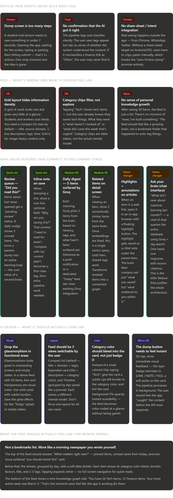
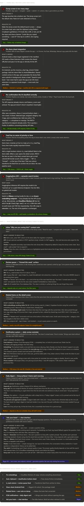

End user feedback 

I'll think about this deeply from a real end-user perspective — someone juggling classes, assignments, meetings, random ideas, and links flying at them all day.

Let me lay this out properly.

Here's my full critical take, structured by what would actually make or break this app in real daily use:

**The core problem is the promise vs the friction gap.** A "second brain" lives or dies by how effortless it is to get things *in* and how magically it surfaces things *out*. Right now the pipeline is technically impressive but the user experience doesn't close either loop properly.

**On the dump side** — the biggest missing piece is the Android/iOS share sheet. Every link I'd want to save I encounter while scrolling Instagram, Chrome, or a PDF viewer. If I have to switch apps, copy, open Second Brain, and paste, I'll use Apple Notes instead. The share-sheet integration is literally the entry point to the app for 80% of real usage. This should be the very first thing built before any UI polish.

**On the feed side** — the current design assumes the user knows what they want to find. But the real value of a second brain is when it *tells you* what you forgot you saved. The "review queue" and "daily digest via Groq" features I mentioned in the widget are not just nice additions — they're the entire reason to use this over a bookmarking app. Groq is already integrated; wiring it to surface 5 items each morning is probably a weekend of work.

**On the "Ask your brain" feature** — this is the killer feature that justifies the entire vector embedding architecture. A chat interface that answers "what did I save about system design" using Groq + your existing search endpoint would make this app genuinely irreplaceable. Every other feature is table stakes. This one is the reason someone tells a friend about the app.

**The UI direction** — keep the Cognitive Nebula identity for onboarding, splash, and empty states where it can breathe. In the dense feed, go clean and scannable. The category color-bleed-on-card idea I mentioned is the single cheapest visual change that would make the feed dramatically more useful — your eye learns the color coding in a day and you can scan 30 items in 5 seconds.

Okay Now consider this feedback , think as a developer who wants to fix these issues realistically and ofcourse with zero cost , Tackle each problem one by one and Come up with solution for each. As for adding features See what all is required for that to make(Overview ,no deep dive into tech stack) for example - Notification system as a reminder ....
Let's leave the UI direction . For now Just focus on functionality usage and Smoothening user experience.

Good framing. Let me think through each problem realistically — what's actually broken, what's the cheapest fix, and what new infrastructure each feature needs.A few things worth calling out clearly:

**The single most important fix is the embeddings** (Fix 5 → Cloudflare Workers AI). It sounds like a backend detail but it's actually the load-bearing piece — the "Ask your brain" feature, the related items feature, and the daily digest quality all get dramatically better once vectors are actually being stored. Cloudflare's free embedding endpoint is genuinely free with no auth headaches, and the change in `embedder.ts` is literally swapping one URL and one auth header. Do this before anything else.

**The share-sheet is the habit-maker.** Every other feature assumes the user is already in the app. The share-sheet means the brain grows passively while the user lives their normal digital life. On Android specifically, `receive_sharing_intent` is a battle-tested package — it's not experimental work. This one change could double how many items actually get saved per day.

**The digest pinned card is smarter than push notifications for v1.** Building FCM from scratch (Firebase project, token management, permission flows, cron scheduler) is a real weekend of setup. The pinned digest card — a daily Groq call that refreshes a small DB table and renders at the top of the feed — delivers 80% of the same value with maybe 20% of the work. Build the card first, bolt on FCM notifications later when the habit is proven.

**"Ask your brain" should be last**, not because it's least valuable but because its quality directly depends on everything above it being solid. Bad retrieval → bad answers → user loses trust in the feature. Get the embeddings right, get the data in cleanly via share-sheet, then build the chat on top of a well-populated, well-indexed brain.